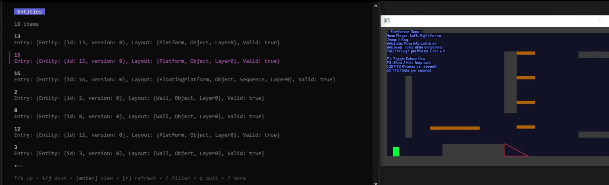
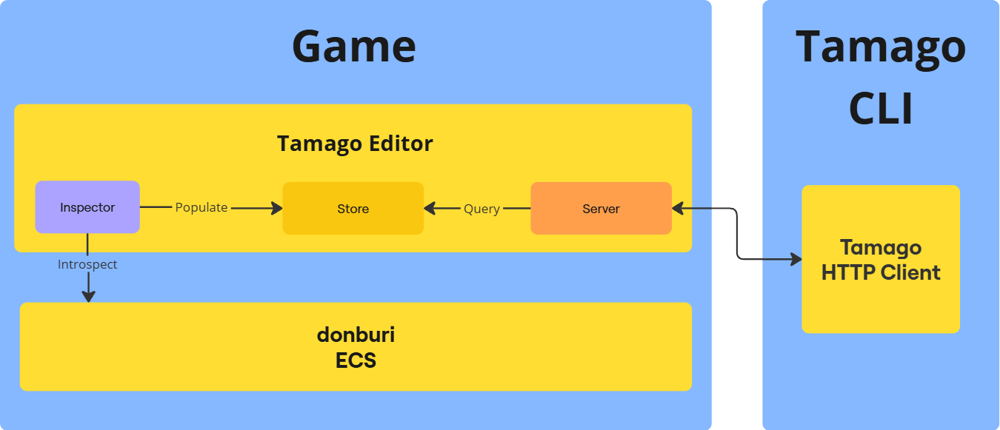

 <h1>Tamago</h1>

 

Tamago is an editor that can be attached to [Donburi](https://github.com/yottahmd/donburi)'s Entity Component System ([ECS](https://en.wikipedia.org/wiki/Entity_component_system)) library for Ebitengine. It assists development by providing a mechanism to view and edit internals of the ECS World during runtime.

It comes with a [CLI](./cli) for users to interface with the ECS World. The underlying [Go HTTP Client](./client) implementation can be used to develop other customized implementations.

## Contents

- [Contents](#contents)
- [Getting Started](#getting-started)
- [Architecture](#architecture)
- [To Do list](#to-do-list)

## Getting Started

## Architecture

The **editor** is split into 3 main components:

1. **Inspector**: periodically iterates over the donburi ECS world and populates the **Store**.
2. **Store**: in-memory cache of donburi internals of the game world.
3. **Server**: control layer that accepts HTTP traffic to operate on the game world, using the Store as the data layer.

The **CLI** is the main presentation layer - its purpose is to query the server and format the data nicely for the consumer.

## To Do list

* Create logo
* Getting Started documentation
* (CLI) Handle entries that are nulled between introspections
* (CLI) Option to clear fields (defaulting them - `""` for strings, `nil` for ptr, etc.)
* (CLI) Short polling / real-time communication with the Server
* (CLI) Loading indicator on I/O operations such as HTTP requests
